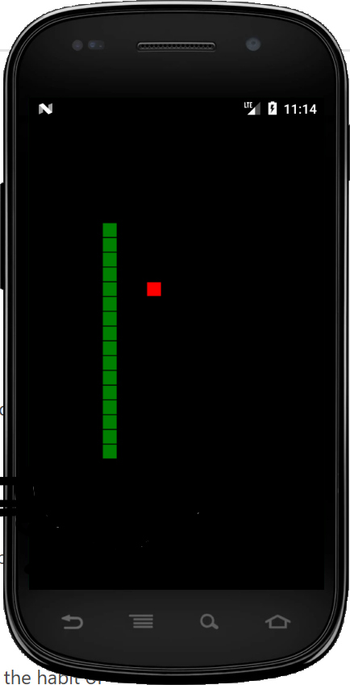

"# classic-snake-game" 

This is my take on the classic Snake game. It is written using Javascript and Cordova. I have tested it on Android. Feel free to port to iOS.

Tools required:
-   Cordova 
-   Java-8 SDK (Required by Cordova)
-   Android SDK with an Android emulators setup.

You can download openJDK from this link:
https://adoptopenjdk.net/

Simply extract the zip file on your disk and then point JAVA_HOME to the foder. You will also need to add the path to your PATH environment variable. I usually override the path so that the actual JDK (13 as of today) is overwritten in a special terminal. You can also setup Visual Studio Code to use the secific JDK.

Also, you will need to add the following two entries to your path:

     1. C:\Users\<your-user-name>\AppData\Local\Android\Sdk\platform-tools
     2. C:\Users\<your-user-name>\AppData\Local\Android\Sdk\tools

Cordova requires these paths before it can build the Android targets. The above two are for Windows. Not sure what will be the equivalent paths on the MAC. Please check the Cordova site.

You will also have to have Gradle on your machine. Cordova/Android uses Gradle to build the Android target.

To Debug using Chrome:
- In the MainActivity.java add:
    import android.webkit.WebView;
 - and in onCreate:
    WebView.setWebContentsDebuggingEnabled(true);
- Then check the device by pointing Chrome to chrome://inspect/#devices

To build on your machine Windows or Mac:

1.  Clone the repository
2.  cordova run --emulator

Enjoy!
